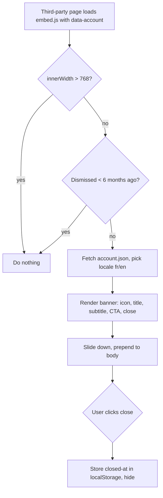

<!-- Fill or omit these sections; never add, rename, or reorder one. -->

# Instruction: embed.js at banner parity

## Architecture projection

> Tree of the final files. ✅ create · ✏️ modify · ❌ delete

```txt
.
├── embed/
│   └── embed.js                   ✅ self-contained vanilla source (markup + injected CSS), zero deps
├── dist/
│   └── embed.js                   ✅ deployed artifact of embed/embed.js
└── wordpress/
    ├── banner-injector.php        ✏️ drop 'jquery' from the enqueue deps array
    └── assets/banner.js           ✏️ confirm zero jQuery usage (already vanilla)
```

## User Journey



## Wireframe

<!-- UI phase only. Parity with the existing WP banner template. -->

```txt
┌──────────────────────────────────────────────────────────────┐
│ (1) plethore-banner  — fixed top, full width, high z-index     │
│  ┌──────────────────────────────────────────────────────────┐ │
│  │ (2) [icon] (3) title            (4) [ CTA ]  (5) [×]       │ │
│  │           subtitle                                         │ │
│  └──────────────────────────────────────────────────────────┘ │
└──────────────────────────────────────────────────────────────┘
```

1. Banner root: fixed, top, full width, slide-down animation, high z-index.
2. App icon (`iconUrl`), rounded.
3. Title + subtitle stacked, left-aligned.
4. CTA anchor → `buttonUrl`, `target="_blank" rel="noopener"`, label `buttonLabel`.
5. Close button (`×`) — dismisses and records the timestamp.

## Tasks to do

### `1)` Write `embed/embed.js`

> One vanilla file that self-injects markup and styles, mirroring the WP banner.

1. At top-level (synchronously), read the account slug: `document.currentScript?.dataset.account`, cached in a const; fall back to `document.querySelector('script[data-account]')?.dataset.account`.
2. Bail early if no slug, if `window.innerWidth > 768`, or if `localStorage["plethore-banner-closed-at"]` is within the last 6 months.
3. Fetch `https://smart-banner.pletho.re/{account}.json`; resolve locale from `navigator.language` (`fr`/`en`, default `en`).
4. Build the banner DOM in code (no template fetch): icon, title, subtitle, CTA anchor (`target="_blank" rel="noopener"` → `buttonUrl`), close button — using the `plethore-banner*` namespaced classes.
5. Inject the namespaced CSS once via a `<style>` tag (port `banner.css`); Shadow DOM optional.
6. Prepend to `<body>`, run the slide-down. Wire the close button to store `Date.now()` and hide.
7. Wrap everything so any error fails silently (no throw, at most a `console.error`).

### `2)` Produce `dist/embed.js`

> The deployable artifact the CDN serves — no build toolchain, keep it zero-deps.

1. Place the deployable `embed.js` at `dist/embed.js` (the artifact of `embed/embed.js`).
2. Commit `dist/embed.js` so Phase 3 can upload it.

### `3)` Drop the jQuery dependency in the WP plugin

> US-01 closes the unused dep in the WordPress channel.

1. In `wordpress/banner-injector.php`, change the enqueue deps from `array('jquery')` to `array()`.
2. Confirm `wordpress/assets/banner.js` uses no jQuery (already vanilla) — no code change expected.

## Test acceptance criteria

<!-- Each criterion is an observable behavior, not a command. -->

| Task | Acceptance criteria                                                                                                                          |
| ---- | -------------------------------------------------------------------------------------------------------------------------------------------- |
| 1    | On a ≤768px viewport, a test page loading `embed.js` with `data-account` renders the banner (icon, localized title/subtitle, CTA, close) prepended to `<body>`; the CTA opens `buttonUrl` in a new tab; clicking close hides it and it stays hidden on reload. |
| 1    | On a >768px viewport, or when dismissed within 6 months, or when the slug is missing/JSON fails, nothing renders and no uncaught error reaches the console. |
| 1    | embed.js loaded with `async` still resolves the slug (currentScript cached at load, or querySelector fallback).                              |
| 2    | `dist/embed.js` exists and runs standalone with no external script or runtime dependency.                                                   |
| 3    | The WP banner still loads and behaves identically with `array()` deps; jQuery is no longer enqueued as a dependency.                          |
