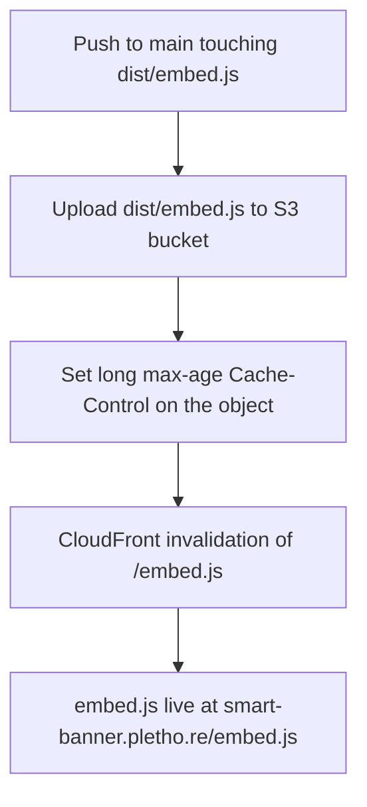

<!-- Fill or omit these sections; never add, rename, or reorder one. -->

# Instruction: CDN deploy & CORS

## Architecture projection

> Tree of the final files. ✅ create · ✏️ modify · ❌ delete

```txt
.
└── .github/
    └── workflows/
        └── deploy-embed.yml       ✅ build + S3 upload + CloudFront invalidation
```

## User Journey



## Tasks to do

### `1)` Add the deploy workflow

> One GitHub Actions job that builds and publishes embed.js on change.

1. Create `.github/workflows/deploy-embed.yml` triggered on push to `main` affecting `dist/embed.js` (plus manual `workflow_dispatch`).
2. Steps: checkout → configure AWS credentials from repo secrets → `aws s3 cp dist/embed.js s3://<smart-banner-bucket>/embed.js` with a long `Cache-Control: max-age` → `aws cloudfront create-invalidation --paths "/embed.js"`.
3. Reference bucket name, CloudFront distribution id, and AWS creds as repo secrets — never hard-code them.

### `2)` Verify cross-origin fetch works

> The banner runs on third-party domains; it must fetch `{account}.json` and load `embed.js` cross-origin.

1. Confirm the CloudFront/S3 response for `{account}.json` carries `Access-Control-Allow-Origin: *` (the WP banner already fetches this cross-origin today — verify it still holds, don't assume).
2. Confirm `embed.js` itself is served with permissive caching and is reachable cross-origin.
3. If any header is missing, add the S3 bucket CORS config / CloudFront response-headers policy to supply `Access-Control-Allow-Origin: *`.

## Test acceptance criteria

<!-- Each criterion is an observable behavior, not a command. -->

| Task | Acceptance criteria                                                                                                     |
| ---- | ---------------------------------------------------------------------------------------------------------------------- |
| 1    | A push touching `dist/embed.js` runs the workflow to green; `https://smart-banner.pletho.re/embed.js` returns the newly uploaded file. |
| 1    | The deployed object carries a long-lived `Cache-Control` and the CloudFront invalidation of `/embed.js` completes in the run. |
| 2    | A `fetch('https://smart-banner.pletho.re/{account}.json')` from a different origin succeeds with `Access-Control-Allow-Origin: *` present; loading embed.js on a third-party test page renders the banner. |
